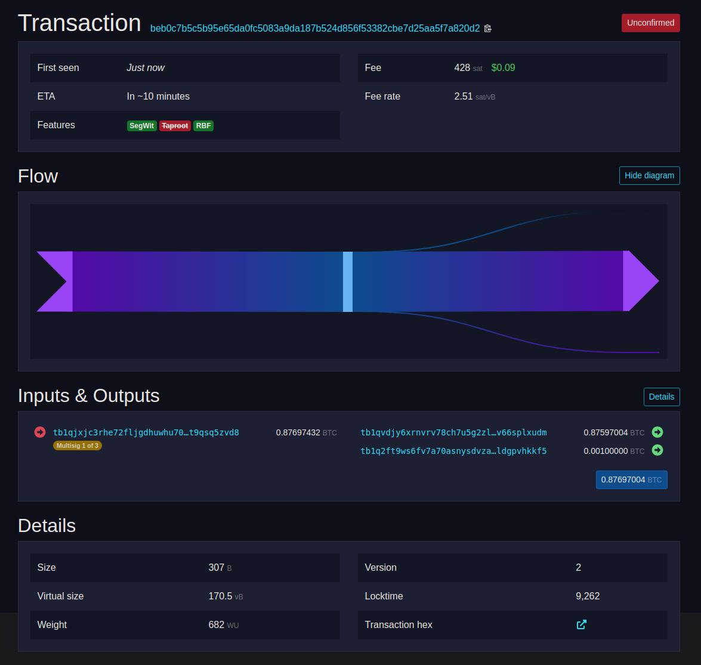

# Getting Some B58 Signet Bitcoin

Create a new wallet called 'b58signetwallet'
- [ ] `bitcoin-cli -signet createwallet b58signetwallet`

Definitely create a backup of this wallet:
- [ ] `bitcoin-cli -signet dumpwallet b58signetwallet`

Now we'll neeed to get some coins. This isn't regtest where we mine blocks ourselves, we'll have to get our coins from someone else. Lucky for you, Base58 runs a Bitcoin Faucet that lets you get some bitcoin to play and test with. When you're done, it's normally nice to send your coins back to the faucet :) 

- [ ] Get a new address with `bitcoin-cli -signet getnewaddress`
- [ ] Send some B58 Signet bitcoin (~0.001) to that address from Base58's faucet at [base58.money](https://base58.money)
- [ ] Check out the transaction on the block explorer, [base58.space](https://base58.space) . It'll have 1 input, and 2 outputs: 1 to you and change back to the faucet.
- [ ] Wait for the transaction to get confirmed (this might take ~10 minutes)

On the blockexplorer, the tx will look something like this:

Once the transaction gets confirmed, you can see it in your wallet from the command line with `bitcoin-cli -signet listunspent`

Congratulations! You've now got some signet bitcoin on Base58's signet! You can send and receive these with anyone else who uses the same base58 signet, so maybe find a friend and try sending and receiving coins with them. You'll be able to see all the transactions on base58's signet block explorer at [base58.space](https://base58.space).